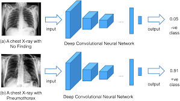
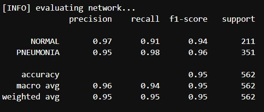

<h1 align="center"><b>X-Ray Image Classification for Pneumonia Detection</b></h1>
<h3 align="center"><b> Chest X-Ray image classification and prediction using Convolutional Neural Networks (CNNs) in Tensorflow </b></h1>

<p align="center"></p>


&nbsp;&nbsp;&nbsp;&nbsp;&nbsp;&nbsp;&nbsp;&nbsp;&nbsp;&nbsp;&nbsp;&nbsp;&nbsp;&nbsp;&nbsp;&nbsp;&nbsp;&nbsp;&nbsp;
&nbsp;&nbsp;&nbsp;&nbsp;&nbsp;&nbsp;&nbsp;&nbsp;&nbsp;&nbsp;&nbsp;&nbsp;&nbsp;&nbsp;&nbsp;&nbsp;&nbsp;&nbsp;&nbsp;&nbsp;


## Background 
The X-Ray image classifier is a seminal work that is capable of detecting whether or not a patient has pneumonia using the patient's lung X-rays. This model uses transfer learning techniques, encircling the DenseNet201 architecture, and performed well in predicting X-ray images correctly with a validation accuracy of 95.19 % .However, this cannot be used as a full proof method to detect pneumonia, as the symptoms of the patient are not taken into account.

## Download Dependencies
```bash
pip install numpy
pip install tensorflow
pip install matplotlib
pip install os
```

## Code 
#### 1. Importing Dependancies
```python
import numpy as np
import tensorflow as tf
from tensorflow.keras.applications.densenet import DenseNet201
from tensorflow.keras.preprocessing.image import ImageDataGenerator
import matplotlib.pyplot as plt
import os
```

#### 2. Getting path of the images stored in google drive
```python
train_norm_dir = os.path.join('/content/drive/My Drive/chest-xray-pneumonia/train/NORMAL/')
train_pneu_dir = os.path.join('/content/drive/My Drive/chest-xray-pneumonia/train/PNEUMONIA/')

val_norm_dir = os.path.join('/content/drive/My Drive/chest-xray-pneumonia/test/NORMAL/')
val_pneu_dir = os.path.join('/content/drive/My Drive/chest-xray-pneumonia/test/PNEUMONIA/')
```

##### 2.1. Getting names of the images stored in google drive
```python
train_norm_names = os.listdir(train_norm_dir)
train_pneu_names = os.listdir(train_pneu_dir)

val_norm_names = os.listdir(val_norm_dir)
val_pneu_names = os.listdir(val_pneu_dir)
```
#### 3. Define the model
```python
pre_model= DenseNet201(include_top=False,
                             weights='imagenet',
                             input_shape=(224,224,3))
for layer in pre_model.layers:
  layer.trainable=True

last_output = pre_model.output

x = tf.keras.layers.Flatten()(last_output)
x = tf.keras.layers.Dense(256,activation='relu')(x)
x = tf.keras.layers.Dropout(0.5)(x)
x = tf.keras.layers.Dense(2,activation='softmax')(x)

model = tf.keras.Model(pre_model.input,x)
```

#### 4. Compile the model
```python
opt = tf.keras.optimizers.Adam(learning_rate=0.0001)
model.compile(optimizer=opt,loss='categorical_crossentropy',metrics=['accuracy'])
```

#### 5. Define the ImageDataGenerators and perform Image Augmentation
```python
train_datagen = ImageDataGenerator(rescale=1.0/255.,
                                   rotation_range=20,
                                   brightness_range=[0.7,1.2],
                                   zoom_range=0.2
                                  )
val_datagen = ImageDataGenerator(rescale=1./255)

train_generator = train_datagen.flow_from_directory('/content/drive/My Drive/chest-xray-pneumonia/train',
                                                    batch_size = 16,
                                                    class_mode='categorical',
                                                    target_size=(224,224))

val_generator = val_datagen.flow_from_directory('/content/drive/My Drive/chest-xray-pneumonia/test',
                                                    batch_size = 16,
                                                    class_mode='categorical',
                                                    target_size=(224,224))
```

#### 6. Train the model
```python
history = model.fit(train_generator,
                    validation_data=val_generator,
                    steps_per_epoch=326,
                    validation_steps=val_generator.samples//val_generator.batch_size,
                    epochs=25)            
```
#### 6. Evaluate the network
```python
print("[INFO] evaluating network...")
predIdxs = model.predict(tsX, batch_size=16)

predIdxs = np.argmax(predIdxs, axis=1)

print(classification_report(tsY.argmax(axis=1), predIdxs,
	target_names=lb.classes_))
```

## How to use

Step 1 : Create folders in GDrive as 

         Main Folder -> train ->PNEUMONIA
                              -> NORMAL
                     -> test ->PNEUMONIA
                              -> NORMAL

Step 2 : Mount drive in google colab

Step 3 : Run all the blocks of Code

## Results 

<p align="center"></p>

